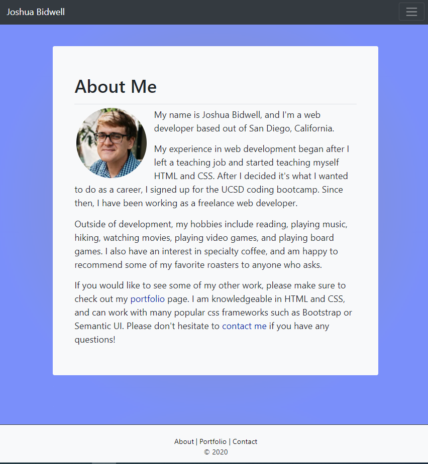

# responsive-portfolio
Responsive Bootstrap Portfolio

Description

This is a sample responsive portfolio made primarily with Bootstrap classes. 

There is a style.css file attached to the project, but I tried to keep that limited to specific styles I couldn't find using Bootstrap. These custom styles are: 

*Background, text, and border colors for text, links, backgrounds, and the submit button on the contact page
*font size
*text-decoration for links
*transition and transform properties that change link text and images when hovered over

EDIT- 9/27/2020 : The page has been updated with a link to my GitHub, resume, email, and my phone number has been added"

EDIT- 10/25/2020 : I have added more of my work to my portfolio, updated my resume, GitHub profile and LinkedIn profile to reflect proficiency in node and MySQL.

Links

Deployed app main page: 
https://jjbidwell.github.io/responsive-portfolio/

Portfolio page: 
https://jjbidwell.github.io/responsive-portfolio/portfolio.html

Contact page: 

https://jjbidwell.github.io/responsive-portfolio/contact.html

Github repository: 
https://github.com/jjbidwell/responsive-portfolio

Screenshots:

